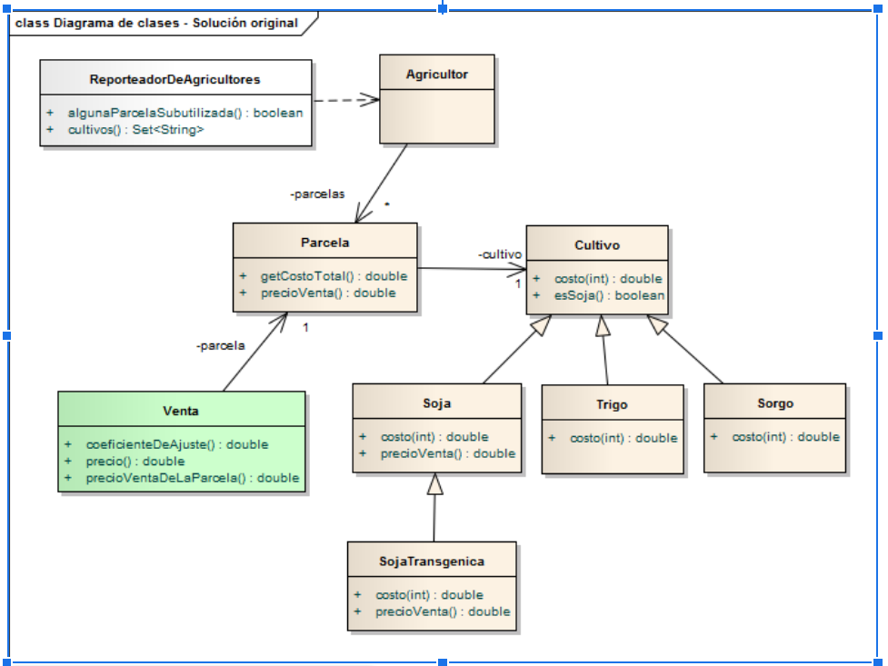

# Ejercicio Agricultores

## Enunciado

Se pide modelar una solución para un grupo de agricultores, que tienen parcelas. Cada parcela tiene

- un tamaño (medido en hectáreas),
- el cultivo que planta,
- la cantidad de hectáreas cultivadas y
- la cantidad (en kilos) de cultivo cosechado, que se guarda en un silo.

Se asume el siguiente circuito:

- El agricultor decide comprar una parcela para cultivar
- Cuando el agricultor siembra sube la cantidad de hectáreas cultivadas
- Cuando el agricultor cosecha disminuye la cantidad de hectáreas cultivadas y sube el
silo (en kilos).
- Al vender, baja el silo en kilos (la cantidad cultivada no cambia)
- En algún momento, el agricultor puede decidir cambiar el cultivo de la parcela, para lo
cual no debe quedar cantidad cultivada en la parcela ni en el silo.

Tenemos diferentes tipos de cultivo:

### Soja

- El costo de la soja es de $ 10 por hectárea
- El precio de venta por kg se calcula como 10 veces el costo x hectárea menos
una retención de 10% si el tamaño de la parcela supera las 1000 hectáreas.

### Soja transgénica

- Se sabe si el que lo come puede sufrir mutaciones genéticas
- El costo por hectárea se calcula igual que la soja
- El precio de venta por kg se calcula igual que la soja o la mitad de ese precio si el
que lo come puede sufrir mutaciones genéticas.

### Trigo

- El costo es de $ 5 por hectárea hasta un máximo de $ 500 (en una parcela de
200 hectáreas el costo es $ 500, en una parcela de 50 hectáreas el costo es $ 250)
- El precio de venta es de $ 20 por kg a los cuales hay que restarle los conservantes del silo (se conoce el costo por kg de cada conservante).

### Sorgo

- El costo es de 3 $ por hectárea si la cantidad cultivada es menor a 50 hectáreas o $ 2 en caso contrario.
- El precio de venta es de $ 20 por kg.

Cada parcela es administrada por un capataz, quien registra las ventas que se producen en una parcela. De cada venta nos interesa registrar:

- Fecha de venta
- Parcela (que determina el cultivo)
- Cantidad de kilos vendidos
- Comprador

El precio total de la venta se calcula como

> FV = Cantidad kilos vendidos * precio venta x kg según la parcela * % coeficiente de ajuste

El coeficiente de ajuste lo determina el comprador:

- A los compradores nacionales se les cobra un % 10 de recargo si la cantidad a comprar
supera los 500 kg.
- A los compradores extranjeros se les aplica a todos el mismo coeficiente
- Hay compradores especiales a los que no se les cobra nada determinados cultivos
(determinado por cada comprador especial) o bien es un % 5 de recargo.

En una parcela sólo se tiene un cultivo, no obstante el cultivo puede cambiar. De todas maneras las ventas de esa parcela deben referenciar al cultivo que corresponde (ej: si planté trigo, vendí todo el trigo y ahora quiero plantar soja, en la parcela el cultivo es soja pero las ventas de trigo de esa parcela deben quedar asociadas al cultivo trigo).

## Qué se pide

Se pide codificar:

1. El costo total del cultivo de una parcela determinada (costo x hectárea por cantidad
cultivada en la parcela).
2. El precio de venta del cultivo de una parcela determinada (precio venta x kg).
3. El monto de una venta para una parcela (considerar la fórmula FV).
4. Cuáles son los cultivos de un agricultor, sin repetidos.

## Una posible solución



Analizar el código, encontrar los "bad smells" y proponer un refactor para cada uno de los puntos.

### Punto 1: Costo de un cultivo

```wollok
class Parcela {
  var cultivo
  var hectareasCultivadas = 100

  method costoTotal() = cultivo.costo(hectareasCultivadas)
}

class Soja {
  method costo(cantidadHectareasCultivadas) = 10 * cantidadHectareasCultivadas
}

class SojaTransgenica inherits Soja {
  method costo(cantidadHectareasCultivadas) = super.costo(cantidadHectareasCultivadas)
}

class Trigo {
  method costo(cantidadHectareasCultivadas) =
      if (cantidadHectareasCultivadas * 5 > 500) {
          500
      } else {
          cantidadHectareasCultivadas * 5
      }
  }
}

class Sorgo {
  method costo(cantidadHectareasCultivadas) =
      if (cantidadHectareasCultivadas < 50) {
          3 * cantidadHectareasCultivadas
      } else {
          2 * cantidadHectareasCultivadas
      }
  }
}
```

### Punto 2: Precio de venta por kg

```wollok
class Parcela {
  method precioVenta() {
    // Soja y SojaTransgenica devuelven true
    if (cultivo.esSoja())
      cultivo.precioVenta(cultivo.costo(hectareasCultivadas),
                          hectareas, 10, 0.1, 1000)
    else {
      var costoConservantes = 0
      if (cultivo.conservantes.size() > 0) {
        cultivos.conservantes.forEach { conservante =>
          costoConservantes += conservante.precio()
        }
      }
      // en cada parcela guardamos los conservantes,
      // si el cultivo es trigo tiene conservantes
      // si el cultivo es sorgo hay una colección vacía
      20 - costoConservantes
    }
  }
}

class Soja {
  method precioVenta(costoTotal, totalHectareas, efecto, retencion, topeHectareas) {
    var retencionPosta = 0
    if (totalHectareas > topeHectareas) {
          retencionPosta = retencion
    }
    return (costoTotal * efecto) * (1 - retencionPosta)
  }
}

class SojaTransgenica inherits Soja {
  var sufreMutaciones

  override method precioVenta(costoTotal, totalHectareas, efecto, retencion, topeHectareas) {
    var retencionPosta = 0
    if (totalHectareas > topeHectareas) {
      retencionPosta = retencion
    }
    const aux = (costoTotal * efecto) * (1 - retencionPosta)
    if (puedeSufrirMutaciones) {
          aux * 0.5
    } else {
          aux
    }
  }
}
```

### Punto 3: Precio total de venta

```wollok
class Venta {
  const parcela
  const cantidadKilos
  const tipoComprador

  method precio() =
    cantidadKilos * self.precioVentaDeLaParcela(parcela) * (1 + self.coeficienteDeAjuste())
  }

  method precioVentaDeLaParcela(parcela) = unaParcela.precioVenta

  method coeficienteDeAjuste() {
    if (tipoComprador == "N") { // Nacional
          if (cantidadKilos > 500) {
                return 0.1
        }
    }
    if (tipoComprador == "E") { // Extranjero
          return COEFICIENTE_PARA_EXTRANJEROS
    }
    if (tipoComprador == "S") { // Especial
        if (cultivosSinRecargo.contains(parcela.cultivo)) {
                return 0.05
        }
    }
    return 0
  }

}
```

### Punto 4: Cultivos de un agricultor

El programador no llegó...
