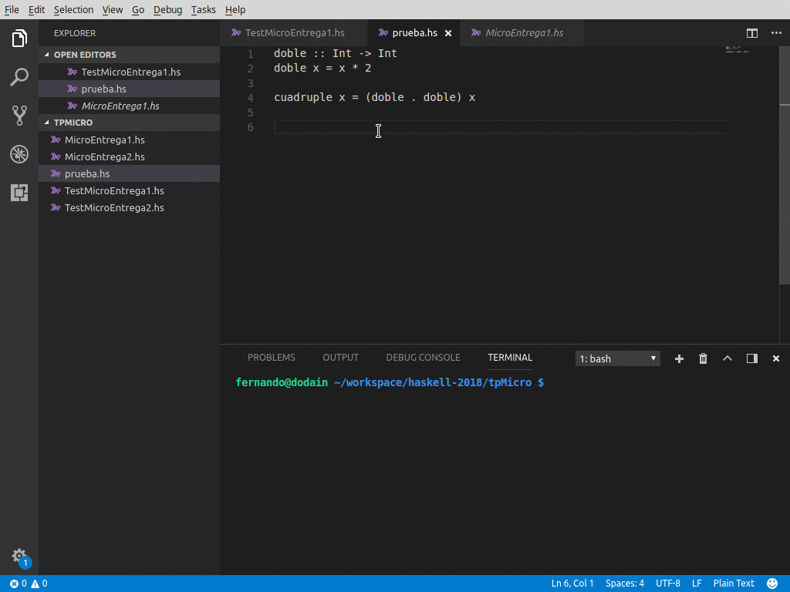
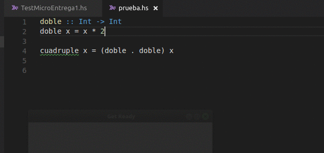

# Instalación y configuración del entorno Haskell

Esta página te ayudará a instalar y configurar el entorno Haskell para realizar todas las prácticas del **paradigma funcional** para los cursos del miércoles a la noche.

Seguir estas instrucciones no es obligatorio para hacer las _katas_ o el trabajo práctico, no obstante tené en cuenta que no vamos a dar soporte de otras tecnologías (son muchas y se vuelve muy difícil lograr que funcionen para todas las máquinas y sistemas operativos). Si tu intención es arreglarte con un _notepad_ asegurate que pase todos los controles necesarios que pide cada enunciado (más adelante los irás conociendo).

> **Nota importante:** respetá el orden de instalación de las cosas, porque algunos componentes necesitan que otros estén previamente instalados.

## Git

Primero que nada, necesitás instalar Git para descargar o subir tu código al hacer las prácticas (y también te servirá para trabajar en conjunto). Te dejamos el [link para descargar Git](https://git-scm.com/downloads) (elegí el que corresponda a tu sistema operativo)

## Instalación básica

Las instrucciones para instalar Haskell están en la [página específica de Paradigmas](http://www.pdep.com.ar/software/software-haskell).

## Stack

**Stack** es un conjunto de herramientas que facilita enormemente el desarrollo comercial y académico en Haskell. Se instala siguiendo [estos pasos](https://docs.haskellstack.org/en/stable/README/#how-to-install) (está disponible para todos los sistemas operativos).

## Intero

Una vez que instalaste Stack, vas a poder descargarte **Intero**, que te permite habilitar el uso interactivo de Haskell para detectar errores y conocer información del programa que estás escribiendo (como los tipos de cada expresión), siguiendo [estos pasos](https://github.com/chrisdone/intero/blob/master/TOOLING.md#installing).

## Editor de texto

Existen [muchas opciones](https://wiki.haskell.org/IDEs), nosotros elegimos [Visual Studio Code](https://code.visualstudio.com/)

### Plugins adicionales

Para mejorar nuestra experiencia de Haskell con Visual Studio Code, hay que instalar los siguientes plugins:

- **Haskero**
- **Markdown All in One**, para leer los enunciados con el formato [Markdown](https://help.github.com/articles/basic-writing-and-formatting-syntax/)
- **GitLens**, para integrar Git con Visual Studio

Si querés ver cómo se instalan los plugins en Visual Studio Code, podés ver este video que muestra cómo se instala Haskero 

## Entorno completo

Si todo quedó correctamente instalado, vas a tener un entorno integrado con el código que vayas escribiendo, como te muestra este video 

