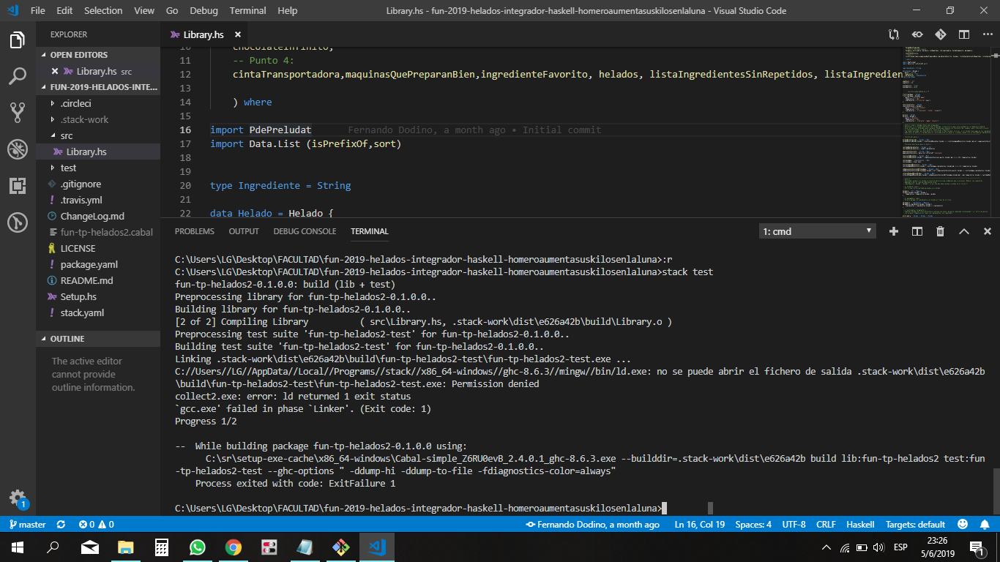
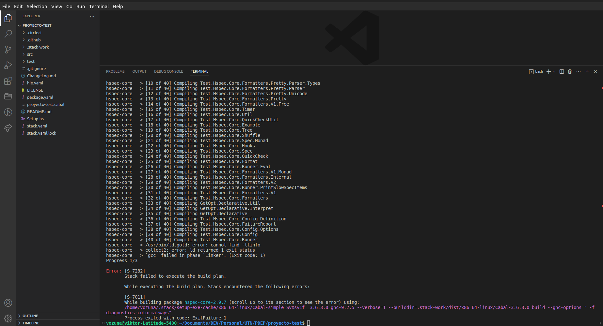
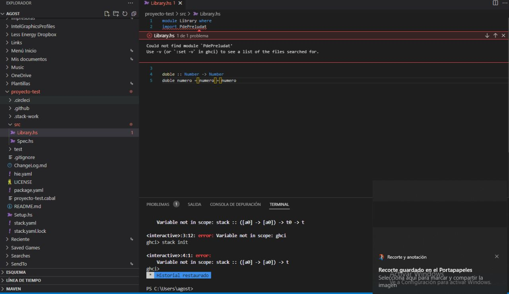

# Troubleshooting Entorno Haskell

## Stack / Haskell

### Invalid argument (invalid character)

Si tenés configurada una terminal que no acepta caracteres unicode, tenés que exportar esta variable:

```bash
export LC_ALL=C.UTF-8
```

(incorporalo a tu `.bashrc` o script favorito cada vez que inicies la consola)

### Al ejecutar el comando stack recibo un mensaje de error

Si ejecutás este comando

```bash
stack new proyecto-test https://github.com/10Pines/pdepreludat/releases/download/latest/pdepreludat.hsfiles
```

y recibís un mensaje de error similar a

```bash
RedownloadInvalidResponse Request {
  host                 = "raw.githubusercontent.com"
  port                 = 443
  secure               = True
  ...
```  

revisá la versión de stack que tenés instalada (siempre en la consola o en el Git Bash).

```bash
stack --version
```

Deberías ver la versión 2.5.1 ó superior, si tenés una versión anterior ejecutá el siguiente comando:

```bash
stack upgrade
```

De esta manera tendrás la última versión de stack instalada en tu máquina.

### Permission denied al ejecutar un comando stack en Windows

Si al intentar ejecutar `stack build`, `stack test` o cualquier otro comando stack te aparece un mensaje de error del tipo `Permission denied`



- **revisá que no tengas caracteres especiales en el path de tu proyecto.** Por ejemplo (espacios, eñes, `°`, tildes, `&`, etc.). Si te encontrás en Windows y en particular es tu carpeta de usuario la que contiene uno de estos caracteres especiales, el error que podés encontrar es del tipo **lexical error in pragma at character**. En este caso es necesario crear un nuevo usuario del sistema para que genere una nueva carpeta de usuario sin estos elementos. Además tenés que reinstalar el entorno para este útimo.

- **revisá si está corriendo de fondo tu antivirus de Windows**, si es así deshabilitalo o configurá para que no haga chequeos en la carpeta donde tenés tus proyectos Haskell.

> El antivirus también puede causar que el comando stack build/test tarde (porque analiza los archivos que genera stack). Lo recomendable es desactivarlo al menos para la carpeta del proyecto donde estés.

### Espacio insuficiente en disco para ejecutar stack ghci/test

Si tenés muy poco espacio en el directorio `/tmp` (espacio temporal de memoria swap), fijate [este artículo](https://stackoverflow.com/questions/67455260/no-space-in-device-error-while-installing-haskell-platform) que te dice cómo resolverlo.

### Haskell: `cannot find -ltinfo` al hacer stack build en ubuntu

Si al hacer `stack build` / `stack ghci` / `stack test` te aparece el siguiente mensaje:

```bash
ExecutionFailure [PrettyException (CabalExitedUnsuccessfully (ExitFailure 1)
 (PackageIdentifier {pkgName = PackageName "hspec-core", pkgVersion = mkVersion [2,9,7]}) 
 "/home/..../.stack/setup-exe-cache/x86_64-linux/Cabal-simple_SvXsv1f__3.6.3.0_ghc-9.2.5" 
 ["--verbose=1","--builddir=.stack-work/dist/x86_64-linux/Cabal-3.6.3.0","build",
 "--ghc-options"," -fdiagnostics-color=always"] Nothing [])]
```



Según la ayuda de stack overflow, deberías ejecutar este comando:

```bash
sudo apt-get install libtinfo-dev
```

aunque en uno de los casos fue necesario instalar esta biblioteca deprecada: `sudo apt-get install haskell-platform -y`.

## Visual Studio Code

### No puede encontrarse el módulo PdePreludat

Si en el Visual Studio Code te aparece el mensaje: "Could not find module 'PdePreludat'" en una ventana similar a la siguiente



fijate que tenés que levantar Visual Studio Code en la carpeta de tu proyecto Haskell (en el caso de la imagen, en `proyecto-test`).

### Problemas con Sistemas Operativos de 32 bits

#### Instalación de stack

Si al intentar ejecutar `stack` sale el siguiente error:

```
cannot execute binary file: Exec format error.
```

Eso es porque probablemente estés en un Windows de 32 bits. Stack ya no soporta sistemas operativos de 32 bits. Desinstalá el stack que tenés instalado, e instalá en su lugar este:

https://github.com/commercialhaskell/stack/releases/download/v2.1.3/stack-2.1.3-windows-i386-installer.exe

_Además_ vas a tener que cambiar la versión del GHC, como se indica a continuación:

#### Cambiar versión de GHC

Si al intentar ejecutar `stack build`, `stack test` o cualquier otro comando stack te aparece un mensaje de error que dice:

```
No setup information found for ghc-x.x.x on your plarform.
This probably means a GHC bindist has not yet been added for OS key 'windows32'.
```

Puede que la versión de GHC que se encuentra configurada en el proyecto no sea compatible con tu sistema operativo. Para solucionarlo hay que cambiar el `resolver` del archivo `stack.yaml`:

```
resolver: lts-14.20
```

Guardar el archivo y volver a ejecutar cualquier comando de `stack` para que que baje la versión de GHC correcta. Esto hay que hacerlo **para todos los assignments que recibas**.

> De todas formas, **recomendamos actualizar el sistema operativo por uno de 64 bits**.
