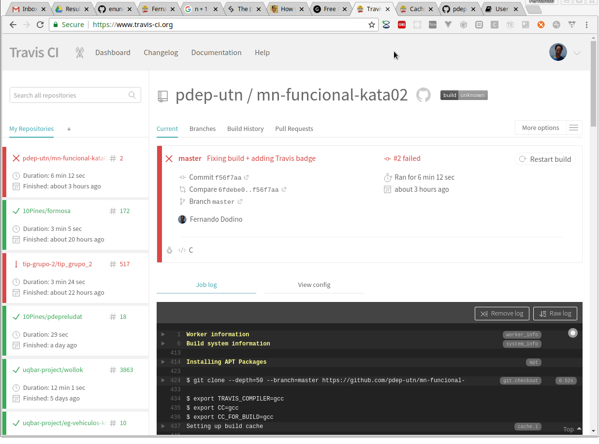
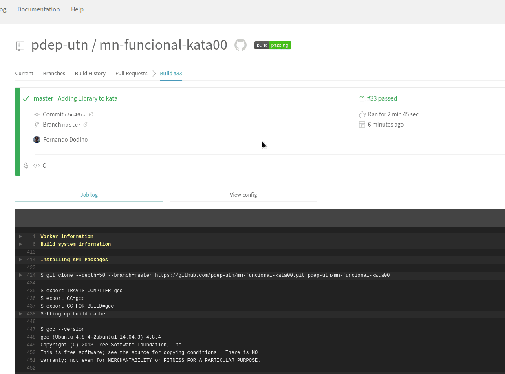

# Integración continua con Travis

<!---

Para terminar la kata, activaremos la [integración continua](https://martinfowler.com/articles/continuousIntegration.html). Esto permite que con cada cambio que hagamos, se compile el proyecto y se ejecuten los tests en un entorno aislado, lo que garantizará detectar el primer cambio en el código que genere un error en nuestro proyecto. En el contexto de una kata puede no parecer tan útil, cuando haya más de una persona trabajando en un ejercicio que tarde más de 2 horas será importante.

Ingresamos al sitio web **Travis**: https://www.travis-ci.org/



Al lado de la solapa MyRepositories, tenés un botón `+` para incorporar nuevos repositorios a Travis, tu gestor de integración continua. En ese link, del lado izquierdo tendrás que seleccionar `pdep-utn` y luego podrás buscar tu repositorio (escribiendo en el texto de búsqueda o esperando que aparezca).

Cuando aparezca, hay un toggle button que debés activar, y luego activar `Settings`, en esa página arriba a la derecha verás un menú contextual `More options`, lo desplegás y elegís `Trigger build`. Te aparecerá una ventana de confirmación, dejás todo por defecto y presionás `Trigger custom build`. Esto

-->

> Cuando aceptes el assignment y generes tu repo, Travis te va a mandar un mail diciendo que falló el build, porque la kata obviamente no está hecha todavía.

A partir de aquí, cada vez que hagas un push, [Travis](https://www.travis-ci.com/) como servidor de integración continua

- clonará el repositorio tuyo
- lo compilará en la tecnología en la que trabajaste
- ejecutará los tests
- y generará el nuevo status de tu proyecto
- en caso de error, te mandará un mail avisándote que el build falló
- y si anduvo ok, te dirá que el build pasó
- de aquí en más, cada vez que hagas un push al repositorio, si anda ok no te dirá nada, pero si falla, te mandará un mail. Es mejor saberlo antes, no?

## Agregando el Badge al README

El _badge_ es un indicador visual de cómo resultó el último build, que ubicaremos en el archivo README para rápidamente darnos cuenta de si anduvo todo bien. Para eso, ingresamos a Travis en https://www.travis-ci.com/, elegimos nuestro repositorio, a la derecha tenemos el badge con el status. Le damos click en la imagen y nos aparecerá una ventana, cambiamos la segunda opción para que aparezca `Markdown` y a continuación copiamos el texto que se visualiza abajo. 



Vamos al editor Visual Studio Code y pegamos el texto. El plugin "Markdown all in one" te permite visualizar el README (con `Ctrl + Shift + V` o bien se puede customizar las teclas).

Por último, tendrás que subir esos cambios al repositorio remoto, una vez más hacemos:

```bash
git add .
git commit -m "Agregamos badge"
git push
```

Acordate que tenés [este apunte](https://docs.google.com/document/d/1ozqfYCwt-37stynmgAd5wJlNOFKWYQeIZoeqXpAEs0I/edit) para guiarte con el proceso de git y [este ayudamemoria](https://docs.google.com/document/d/147cqUY86wWVoJ86Ce0NoX1R78CwoCOGZtF7RugUvzFg/edit#).
