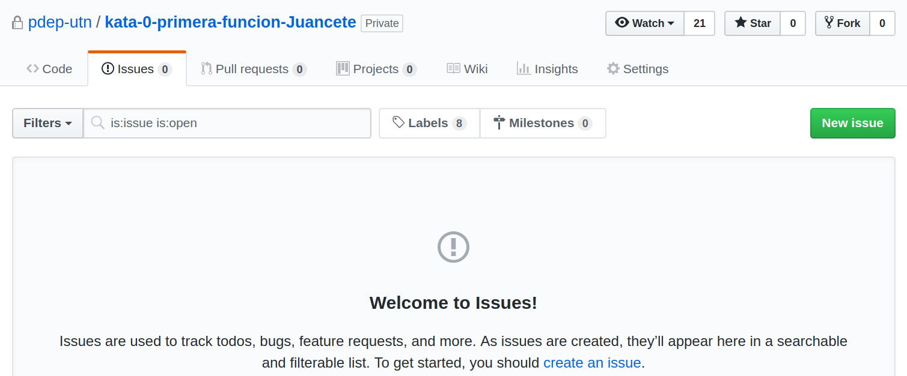

# Guía para la corrección de Katas - miércoles a la noche

## Compañero tutor

Primero, revisá cuál es tu compañero tutor en [la lista de buena fe](https://docs.google.com/spreadsheets/d/1-sVFvdMYr9UjH5MtDp_jsByGFysUzp4NUb5CshxSLWY/edit#gid=1959572195), y ponete de acuerdo quién y cómo van a corregir. Lo ideal es que

- uno haga la corrección
- y otro lo revise
- lo miren juntos, y después cuando terminen les mandan un mail a los chicos con el link al issue o bien taggean a los dos usuario de github cuando terminen la corrección: ej. `@fdodino @Juancete`

## Conocer tus grupos

En la planilla del curso [K2052](https://drive.google.com/open?id=1h3zS_0IiAgVzw2p-A2X4dVUgVcDozZVXQXGN4hES3Qg) o [K2152](https://drive.google.com/open?id=1jRJOhhPgLrPJniDmLZSvspT36MKfA8WwAs0SEI1Rb7M), buscate en la columna D a ver qué grupos te tocan. Vas a reconocerlos porque tendrán la descripción del número de grupo corrector que tenés. Ej: `1 - JuanC/Diego`.

> Fundamental: si no vas a poder corregir, hablalo con tu backup. Si ninguno de los dos puede corregir esta kata, avisale a Juan/Dodain, para que activen la guardia de emergencia.

## Ingresar a los repos

En [github classroom](https://classroom.github.com/classrooms/8278072-paradigmas-de-programacion-utn), deberías ingresar a la Kata que corresponda, por ejemplo [la kata 0](https://classroom.github.com/classrooms/8278072-paradigmas-de-programacion-utn/assignments/kata-0-primera-funcion) y esa página te va a abrir todos los repositorios. Ingresá únicamente a los repos de los tutoreados que están en la planilla, hay que identificarlos por la columna C (usuario github) del curso. Como el TP es individual, cualquiera de los dos integrantes puede haber subido a su repo la solución.


Para entrar al repo, hay que hacer click en `View Repository`.

## Primer control: badge y build manual

Si tiene badge, deberíamos ver un `Passed` o un `Failed` del CI de Circle. Lo que sigue es: descargarse el repo:

```bash
git clone https://github.com/pdep-utn/repositorioDelAlumno
stack build intero
stack test
```

Deberían pasar los tests. Y en el README deberían tener los dos integrantes.

## Corrección del código

En un segundo paso, hay que mirar en la carpeta `src` el archivo `Library.hs` (y por las dudas el test, por si lo cambiaron). Anotan las correcciones generales:

- nombre de las variables
- abstracciones utilizadas
- utilización de los conceptos que pide cada objetivo
- evitar repetición de código
- etc.

## Nuevo issue

La mejor forma de dejar la corrección en la kata es asociarle un issue, para lo cual van a la solapa issues (`url del repo/issues`), y hacen click sobre `New issue`:



En el issue publican toda la corrección, incluyendo si lo quieren soluciones alternativas. Su compañero tutor lo puede revisar y ajustar.

Algunos tips:

- Para entremezclar código, está bueno utilizar los acentos graves con el sufijo haskell (\`\`\`haskell), para activar el coloreado de sintaxis (de lo contario quedará todo en negro)
- No utilicen tablas, suelen ser complicadas y molestan para insertar código
- Cualquier duda, apóyense con [el link al markdown cheatsheet](https://github.com/adam-p/markdown-here/wiki/Markdown-Cheatsheet)

El issue no se cierra, simplemente queda como evidencia de que fue corregido y el alumno puede iniciar una conversación dentro del issue para despejar dudas.

Recuerden ponerse de acuerdo sobre la forma en que van a comunicar la corrección a los alumnos (tags en el issue o mail).

## Pasar la nota a la planilla

Una vez pasada la nota a la planilla, ponen un 0, 1, 2 (ó 3 cuando haya puntos BONUS). En caso de dudas, escriben a la lista de profesores.