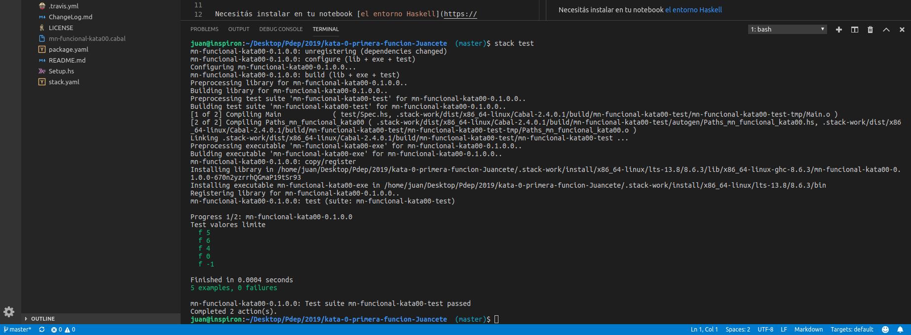
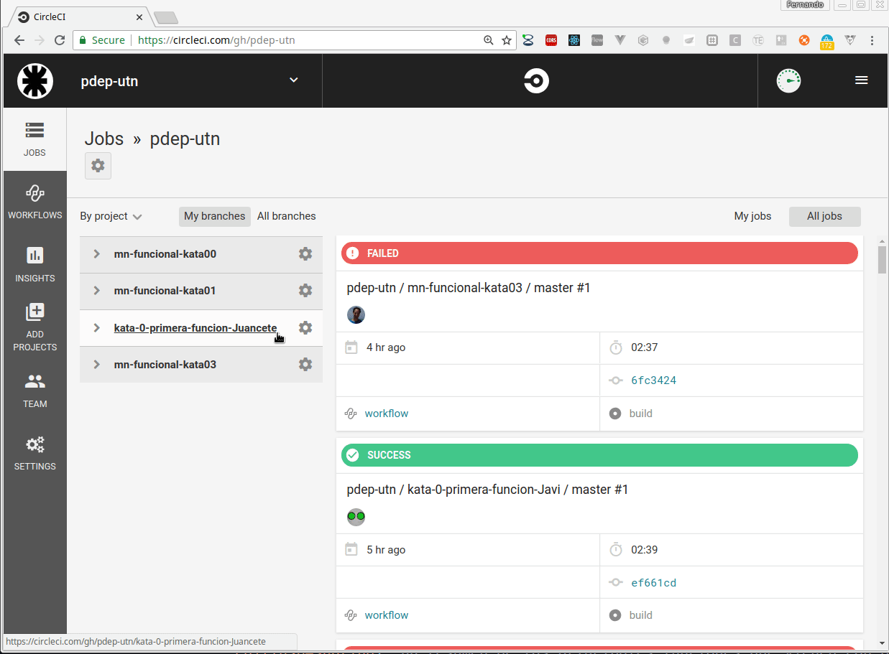
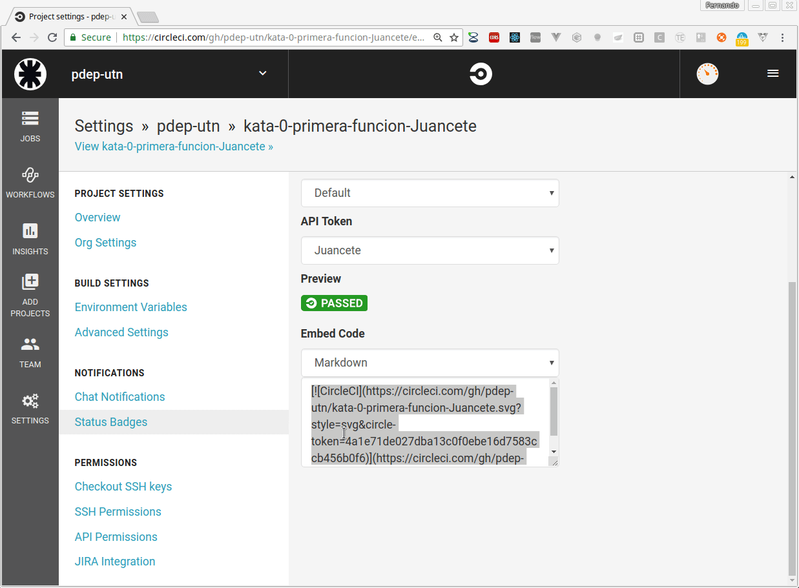

# Guía de resolución de una Kata / TP

> El presente instructivo sirve como descripción del proceso general de una kata o bien del Trabajo práctico integrador

## Entrar al link de github classroom

En primer lugar tenemos que acceder al link del _assignment_ en GitHub para la kata en cuestión que nos provee el docente. Para ello tenemos que encontrarnos logueados en el sitio. Entonces, presionamos el botón _"Accept this assignment"_:


Nos aparecerá una pantalla de creación de un repositorio sobre el cual vamos a trabajar.


Una vez que termine el proceso nos va a brindar un link del repositorio que nos pertenece para resolver la Kata: el segundo link que dice "Your assignment has been created here".


## Clonar el repositorio

Alto!!! Antes que nada, si es la primera vez que vas a utilizar git en tu computadora, es necesario cargar tus datos que formarán parte de tu identificación cuando trabajes en cualquier repositorio de git ejecutando los siguiente comandos en un Terminal/GitBash:

```bash
git config --global user.name <nombre>
git config --global user.email <mail>
```

Completando tu nombre y tu mail. Por ejemplo:

```bash
git config --global user.name "John Doe"
git config --global user.email johndoe@example.com
```

Ahora si, ya tenemos nuestro repositorio remoto con una serie de archivos y carpetas generadas que nos da la estructura de un proyecto Stack. A la derecha de nuestra pantalla tenemos un botón verde que dice **Clone or download**. Al presionarlo nos levanta un pequeño popup con un link a una pagina de GitHub finalizada en _.git_


copiamos ese vínculo y procedemos desde un [terminal o GitBash](https://git-scm.com/downloads) a clonar el repositorio mediante el comando **git clone** seguido de la URL copiada. Por ejemplo

```bash
git clone https://github.com/pdep-utn/kata-0-primera-funcion-Juancete.git
```


## Editar en Visual Studio Code

Para poder editar el código necesitamos tener instalado el [entorno de Haskell](./entorno-haskell.md). Antes que nada, haremos un build del proyecto en la consola Git Bash o la de Linux:

```bash
cd nombre-de-tu-proyecto
stack build intero        # intero => Visual Studio Code
stack build               # build de la kata propiamente dicha
```

Si es la primera vez que ejecutaste estos comandos en tu computadora de stack, seguramente tengas una demora importante al bajar todos los componentes para el entorno y las dependencias del proecto. La próxima vez que lo hagas en un proyecto nuevo, va a tardar muy poco tiempo.

Todos los pasos que realizaste hasta acá se ejecutan cuando bajás un proyecto a tu computadora. A partir de acá es lo que tenés que hacer para volver a trabajar sobre la misma Kata. Ahora sí abrimos el Visual Studio Code (VSCode), desde la línea de comandos es

```bash
code .
```

O bien buscás el acceso al ejecutable, levantás el VSCode y abrís la carpeta del proyecto (Archivo > Abrir carpeta... o el shortcut _ctrl + k + o_)

## Actualización del README.md

Un detalle muy importante es que deben escribir en el archivo `README.md` del directorio raíz quiénes son los integrantes del grupo que está resolviendo la kata. El formato de ese archivo es markdown, por eso te dejamos una [guía rápida](https://github.com/adam-p/markdown-here/wiki/Markdown-Cheatsheet) aunque es muy fácil acostumbrarse, solo tenés que escribir algo como

```
# Kata xxxxxxxx
...

## Integrantes

- Juan Contardo (Juancete)
- Fernando Dodino (fdodino)

## Objetivos
...
```

- Debemos publicar los nombres de los integrantes y el mail/usuario de github, anteponiendo los guiones para generar las viñetas. Para pre-visualizar el README, tenés que haber instalado previamente el plugin "Markdown all in one". Entonces aparecerá la opción "Abrir vista previa en el panel lateral" o bien las teclas `Ctrl + K + V`


## Trabajo de la kata propiamente dicha

Seleccionamos la carpeta donde clonamos nuestro repositorio. Ahora tenemos que trabajar en el archivo **Library.hs** de la capeta **src**


## Probar manualmente el ejemplo

Tenemos la posibilidad de abrir un terminal del sistema operativo dentro de VSCode yendo a al menú _Terminal -> nuevo terminal_, o bien abrir un terminal nativo del sistema. Allí podremos llamar a nuestro intérprete de Haskell (Ghci) mediante el comando

```bash
stack ghci
```

Y podemos jugar con nuestra función/es desarrolladas


Para poder salir del intérprete Haskell solamente es necesario ingresar el comando **:q**

## Pruebas automatizadas

Para correr los tests automatizados es necesario correr desde el terminal los siguientes comandos:

```bash
stack clean
stack test
```

El comando `stack clean` previo sirve a partir de la segunda vez (cuando hagas cambios a los archivos).



Aquí podemos ver de forma visual si nuestro desarrollo cumple con los requisitos esperados que fueron modelados mediante una batería de tests. Como se puede ver en la imágen anterior al estar todos los tests en verde tenemos la seguridad que la funcionalidad es correcta. En caso de tener un error nos muestra detalladamente cual es la falla:


## Subir la Kata resuelta

Una vez finalizada la resolución de la Kata y si pasaron todos los tests correctamente, procedemos mediante el siguientes comandos:

- subir al repositorio local

```bash
git add .
git commit -m "Kata xx resuelta"
```

Antes de hacer add y después, podés chequear los archivos modificados con este comando:

```bash
git status
```

- Subir al repositorio remoto

```bash
git push origin master
```  

## Continuous integration

Para terminar la kata, activaremos la [integración continua](https://martinfowler.com/articles/continuousIntegration.html). Esto permite que con cada cambio que hagamos, se compile el proyecto y se ejecuten los tests en un entorno aislado, lo que garantizará detectar el primer cambio en el código que genere un error en nuestro proyecto. En el contexto de una kata puede no parecer tan útil, cuando haya más de una persona trabajando en un ejercicio que tarde más de 2 horas será importante.

Ingresamos al sitio web **Circle-CI**: https://circleci.com/dashboard


Arriba a la izquierda, debemos cambiar el repositorio a navegar para que apunte a `pdep-utn`. Luego agregaremos nuestro nuevo proyecto, mediante la opcion `Add Projects`, que nos permite buscar por ejemplo `kata00`. Presionamos el botón `Set Up Project`, salteamos los primeros 4 pasos que ya lo hemos hecho por vos y solamente debemos presionar el botón `Start bulding`. Esto nos llevará a la ventana de Jobs donde CircleCI

- clonará el repositorio tuyo
- lo compilará utilizando `stack`
- ejecutará los tests
- y generará el nuevo status de tu proyecto
- en caso de error, te mandará un mail avisándote que el build falló

> Vos no tenés que hacer nada más que activar el build de tu proyecto. El resto lo hace solito CircleCI, que es un servidor de **Continuous Integration**

## Agregando el Badge al README

El _badge_ es un indicador visual de cómo resultó el último build, que ubicaremos en el archivo README para rápidamente darnos cuenta de si anduvo todo bien. Para eso, ingresamos a CircleCI, elegimos nuestro repositorio, a la derecha tenemos el link a `Settings` (Configuración), luego seleccionamos `Status Badge` y debemos generar un Token de seguridad para nuestro repositorio privado. Elegimos una etiqueta o _label_ para identificar ese token posteriormente, y volvemos al menú `Status Badge`. Entonces en el combo elegimos el token que acabamos de crear, y abajo de todo tendremos un cuadro de texto con el formato markdown para copiar.



Vamos al editor Visual Studio Code y pegamos el texto. Si lo deseás, podés modificar la opción `style=svg` por `style=shield`, que tiene un aspecto más _cool_ (o cheto). El plugin "Markdown all in one" te permite visualizar el README (con `Ctrl + Shift + V` o bien se puede customizar las teclas).



## Corrección de tus tutores

Luego tus tutores subirán un issue en tu repositorio con la corrección.

## Resumen de cómo trabajaremos en Haskell

