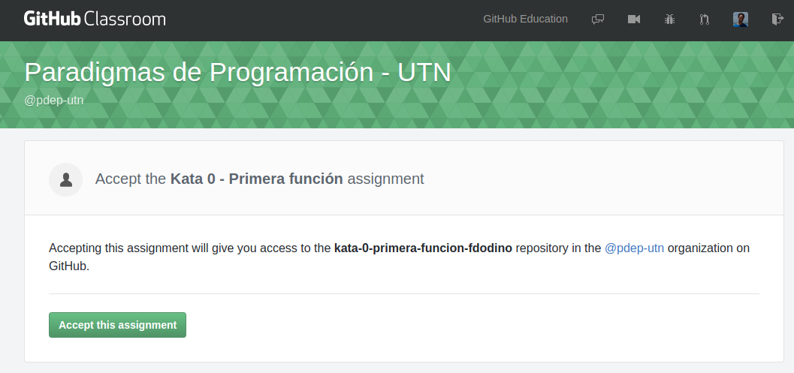
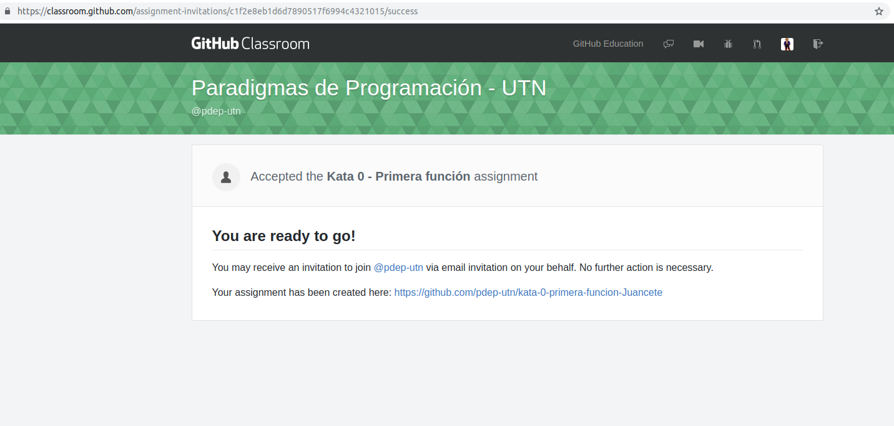
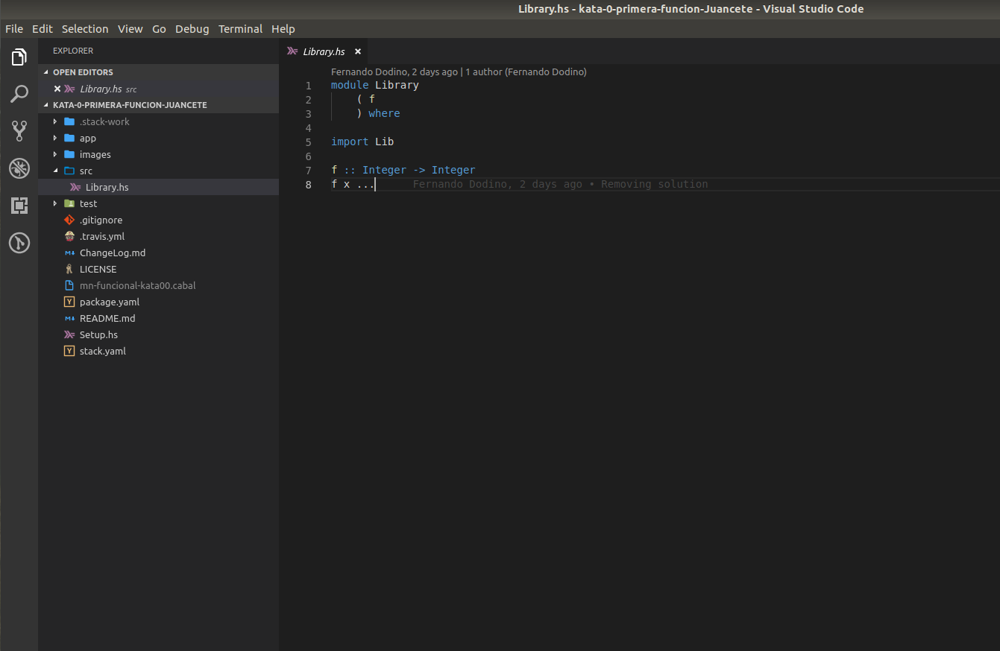
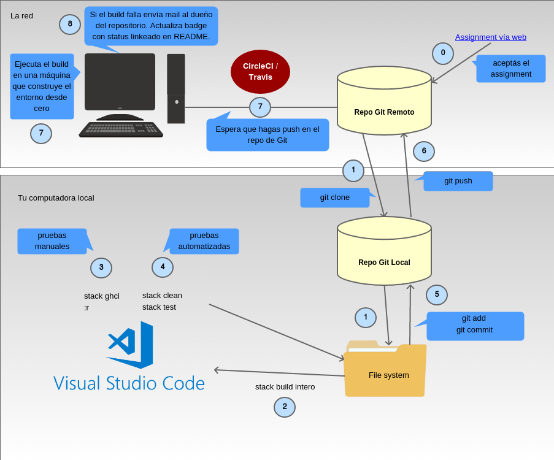

# Guía de resolución de una Kata / TP

> El presente instructivo sirve como descripción del proceso general de una kata o bien del Trabajo práctico integrador

## Entrar al link de github classroom

En primer lugar tenemos que acceder al link del _assignment_ en GitHub para la kata en cuestión que nos provee el docente. Para ello tenemos que encontrarnos logueados en el sitio. Entonces, presionamos el botón _"Accept this assignment"_:



Nos aparecerá una pantalla de creación de un repositorio sobre el cual vamos a trabajar.


Una vez que termine el proceso nos va a brindar un link del repositorio que nos pertenece para resolver la Kata: el segundo link que dice "Your assignment has been created here".



## Clonar el repositorio

Alto!!! Antes que nada, si es la primera vez que vas a utilizar git en tu computadora, es necesario cargar tus datos que formarán parte de tu identificación cuando trabajes en cualquier repositorio de git ejecutando los siguiente comandos en un Terminal/GitBash:

```bash
git config --global user.name <nombre>
git config --global user.email <mail>
```

Completando tu nombre y tu mail. Por ejemplo:

```bash
git config --global user.name "John Doe"
git config --global user.email johndoe@example.com
```

También está bueno que agregues esta configuración para que no aparezca un mensaje de advertencia cuando quieras bajar código (ejecutalo en Git Bash o la terminal):

```bash
git config --global pull.rebase false
git config --global init.defaultBranch master
```

Ahora sí, ya tenemos nuestro repositorio remoto con una serie de archivos y carpetas generadas para cada tecnología. A la derecha de nuestra pantalla tenemos un botón verde que dice **Clone or download**. Al presionarlo nos levanta un pequeño popup con un link a una página de GitHub finalizada en _.git_


copiamos ese vínculo y procedemos desde un [terminal o GitBash](https://git-scm.com/downloads) a clonar el repositorio mediante el comando **git clone** seguido de la URL copiada (te recomendamos que sea SSH siguiendo la configuración en la página [entorno](../haskell/entorno.md)). Por ejemplo

```bash
git clone git://github.com/pdep-utn/kata-0-primera-funcion-Juancete.git
```


## Pre-requisito: instalación del entorno

Para poder editar el código necesitamos tener instalado el entorno correspondiente. En el caso del Paradigma Funcional, será el [entorno de Haskell](../haskell/entorno.md). Antes que nada, haremos un build del proyecto en la consola Git Bash o la de Linux:

```bash
cd nombre-de-tu-proyecto
stack build               # build de la kata propiamente dicha
```

> Si es la primera vez que ejecutaste estos comandos de stack en tu computadora, seguramente tengas una demora importante al bajar todos los componentes para el entorno y las dependencias del proyecto. La próxima vez que lo hagas en un proyecto nuevo, va a tardar muy poco tiempo (menos de 1 minuto).

## Editar en Visual Studio Code

Todos los pasos que realizaste hasta acá se ejecutan cuando bajás un proyecto a tu computadora. A partir de acá es lo que tenés que hacer para volver a trabajar sobre otro assignment. Ahora sí abrimos el Visual Studio Code (VSCode), desde la línea de comandos es

```bash
code .
```

O bien buscás el acceso al ejecutable, levantás el VSCode y abrís la carpeta del proyecto (Archivo > Abrir carpeta... o el shortcut _ctrl + k + o_)

## Actualización del README.md

Un detalle muy importante es que deben escribir en el archivo `README.md` del directorio raíz quiénes son los integrantes del grupo que está resolviendo la kata. El formato de ese archivo es markdown, por eso te dejamos una [guía rápida](https://github.com/adam-p/markdown-here/wiki/Markdown-Cheatsheet) aunque es muy fácil acostumbrarse, solo tenés que escribir algo como

```
# Kata xxxxxxxx
...

## Integrantes

- Juan Contardo (Juancete)
- Fernando Dodino (fdodino)

## Objetivos
...
```

- Debemos publicar los nombres de los integrantes y el mail/usuario de github, anteponiendo los guiones para generar las viñetas. Para pre-visualizar el README, tenés que haber instalado previamente el plugin "Markdown all in one". Entonces aparecerá la opción "Abrir vista previa en el panel lateral" o bien las teclas `Ctrl + K + V`


## Trabajo de la kata propiamente dicha (Haskell)

Seleccionamos la carpeta donde clonamos nuestro repositorio. Ahora tenemos que trabajar en el archivo **Library.hs** de la capeta **src**



Te dejamos el link para que veas [cómo es el trabajo en el paradigma funcional con el lenguaje Haskell](../haskell/trabajo.md)

## Subir la Kata resuelta

Una vez finalizada la resolución de la Kata y si pasaron todos los tests correctamente, procedemos mediante el siguientes comandos:

- subir al repositorio local

```bash
git add .
git commit -m "Kata xx resuelta"
```

Antes de hacer add y después, podés chequear los archivos modificados con este comando:

```bash
git status
```

- Subir al repositorio remoto

```bash
git push origin master
```  

## Continuous integration

La integración continua es un proceso que permite validar cualquier cambio que se introduce en el código, ejecutando los tests en una máquina en la nube. Lo bueno es que no necesitás hacer nada, solamente te va a llegar un mail si el proyecto que subiste a github no compila o los tests fallan.

## Corrección de tus tutores

Luego tus tutores subirán un issue en tu repositorio con la corrección.

## Resumen de cómo trabajaremos en Haskell

En el gráfico la integración continua está dada por Github Actions en lugar de Circle CI / Travis (fueron las variantes anteriores a 2023). 


