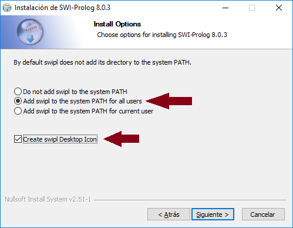
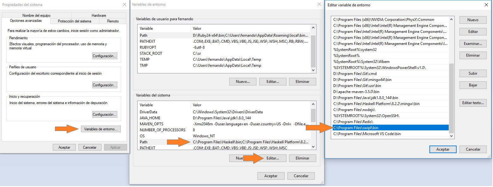
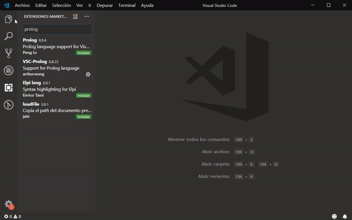
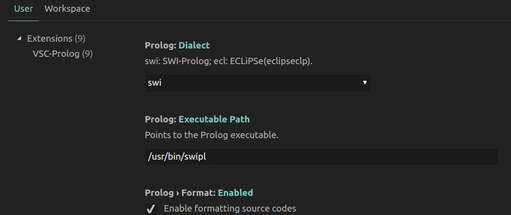

# Instalación y configuración del entorno Prolog

Esta página te ayudará a instalar y configurar el entorno Prolog para realizar todas las prácticas del **paradigma lógico** para los cursos del miércoles a la noche.

## Prolog Online para salir del paso

Si necesitás hacer pruebas rápidas en tu celular, o tablet, o en el trabajo donde no te dejan instalar nada, utilizalo online mediante la página [SWISH](https://swish.swi-prolog.org/). Pero para las _katas_ o bien para el _trabajo práctico_, te dejamos el entorno recomendado.

## Prolog en Android!

Gracias a Lucas Cornero que mandó este mail, pudimos comprobar que Prolog también funciona en dispositivos móviles:

> Hola. Estuve navegando en la pagina de SWI-Prolog y vi que se podía instalar en Android . Me llamo la atención  y lo instale. Lo estuve probando y vas bastante bien se pueden hacer pruebas, cargar programas, probar los test, etc. Lo único que malo que tiene es que cuando se hace make saltan unos mensajes de warning que no hay darle bola. Esta opción de instalar SWI-Prolog y Git en el celular me pareció útil para cuando estamos viajando o la compu falla por algún motivo y necesitamos practicar o subir código sin la necesidad de tener la computadora. Dejé todo documentado en un repositorio que hice por si alguien quiere probarlo también.

https://github.com/luk-s12/Swi-prolog-y-Git-en-Android

## Ejecutable Prolog

El entorno ejecutable SWI Prolog se descarga desde este link: [https://www.swi-prolog.org/download/stable](https://www.swi-prolog.org/download/stable).

> **IMPORTANTE**: que sea la versión 7.6 ó posterior para que se integre con Visual Studio Code

Si instalaste la versión 6.20, te recomendamos que

- la desinstales
- instales la nueva versión.

> Acordate que debe respetar el sistema operativo en el que estás (sea de 32 ó 64 bits)

- incorporen a la variable PATH del entorno del sistema operativo. Esto lo pueden hacer de dos maneras: en el instalador seleccionan la opción para que lo incorpore automáticamente al PATH (además de crear un ícono de escritorio)



en algunos casos pueden aparecer Warnings como `Path too long`, entonces lo configuran manualmente: por ejemplo, el ejecutable que está en `C:\Program Files\swipl\bin`. Te dejemos [este link de muestra](https://www.computerhope.com/issues/ch000549.htm)



El ejecutable en Prolog será

- `swipl` si estás en Windows
- `prolog` si estás en Linux/Mac

Asegurate que te lo reconozca en cualquier directorio donde te pares o vas a tener una mala experiencia con Prolog.

## Editor de texto

Existen [muchas opciones](https://wiki.haskell.org/IDEs), nosotros elegimos [Visual Studio Code](https://code.visualstudio.com/)

### Plugins adicionales

Para mejorar nuestra experiencia de Haskell con Visual Studio Code, se deben instalar los siguientes plugins:

- **VSC-Prolog**, de Arthur Wang. Te dejamos [la página que trae tutoriales para trabajar con el plugin](https://marketplace.visualstudio.com/items?itemName=arthurwang.vsc-prolog)

Si no lo instalaste previamente, recomendamos que incorpores a la lista de plugins

- **Markdown All in One**, para leer los enunciados con el formato [Markdown](https://help.github.com/articles/basic-writing-and-formatting-syntax/)
- **GitLens**, para integrar Git con Visual Studio

### Configuración adicional para Windows

Si estás en Windows probablemente el plugin no encuentre el ejecutable donde está SWI Prolog para compilarlo y mostrarte errores en el código. Si es así, cambiá la configuración donde está el ejecutable siguiendo [estos pasos](https://github.com/arthwang/vsc-prolog/issues/4), en la configuración sobreescribí el valor por defecto de "Prolog: **Executable Path**" modificándolo a este valor

```json
C:\Program Files\swipl\bin\swipl
```

o donde hayas instalado SWI Prolog (en mi caso lo instalé en C:\Program Files\swipl, eso genera una carpeta bin donde está el ejecutable `swipl.exe`). Si tu default es `C:\Program Files\pl`, fijate si no instalaste la versión 6 que no funciona con el plugin de Visual Studio Code.



Si te aparece un mensaje `Cannot lint the prolog file. The Prolog executable was not found. Use the 'prolog.executablePath' setting to configure` es que el path que le definiste no es el correcto.

### Configuración de Linux

En Linux debés apuntar con la barra común adonde esté instalado SWI Prolog (por defecto funciona ok):



## Cómo trabajar en el entorno

Podés levantar Prolog por afuera del Visual Studio Code o bien abrir una terminal y escribir

```bash
swipl nombreDelArchivo.pl  // por ejemplo, Solucion03.pl
```

Esto levantará el archivo y ejecutará los tests, que también podés correr haciendo

```prolog
? run_tests.
```

Para salir de Prolog

```prolog
? halt
```

Y cuando hagas cambios en Visual Studio Code, para refrescar los tests debés correr

```prolog
? make.
```

Lo mismo podés hacerlo en la ventana Prolog, a partir de los comandos `Consult...` (abre un archivo Prolog nuevo), `Reload modified files` (es el make) o `Edit` (levanta el editor de texto de Prolog)

## Troubleshooting

### Undefined procedures?

Asegurate que cuando definas un tests todos los predicados existan, aunque fallen, porque si no vas a experimentar problemas raros como:

- tests que no pasan pero que cuando los evaluás en la consola funcionan satisfactoriamente
- predicados que dicen que no existen:

```bash
ERROR: d:/workspaces/prolog-2019/kata-2-logico-fdodino/solucion02.pl:31:
        test pedidoZarpado: received error: plunit_delivery:'unit body'/2: Undefined procedure: plunit_delivery:pedidoZarpado/1
  However, there are definitions for:
        pedidoZarpado/1
```

La otra forma de resolverlo cuando pasa eso es **salir con halt/0 y luego levantar SWI Prolog**.

### Caracteres "especiales" (ñ, tildes)

Como de costumbre, los caracteres "extras" no son tenidos en cuenta y si querés hacer

```prolog
suelda(caño(plomo), hebe).
```

puede que en algunos entornos (como Windows) tengas inconvenientes. En ese caso podés incorporar al comienzo [la directiva que define el _encoding_ utf-8](https://www.swi-prolog.org/pldoc/man?predicate=encoding/1) que contempla esos caracteres especiales:

```prolog
:- encoding(utf8).
```

Agradecemos a Lucas Cornero por el **tip**.
